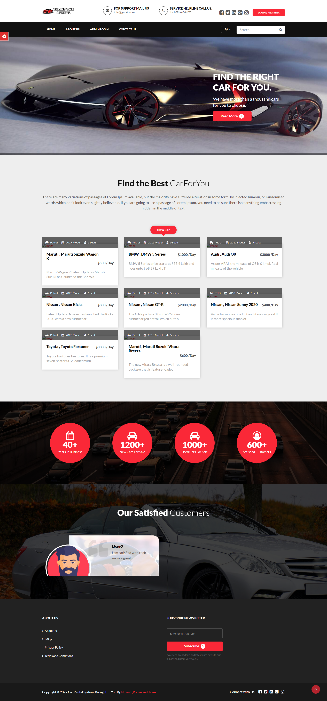

# Car-rental-management-system

## Follow the following instructions to run:

1. Download and install [xampp-windows-x64-8.1.12-0-VS16-installer.exe](https://www.apachefriends.org/) or You can also download another version like wamp server.
2. Navigate to localhost/phpmyadmin and create a new database called carrental
3. When it has been created, navigate to import tab. Then select the sql file in this folder. Select go.
4. You can navigaate to the system via localhost/carrental
5. Username and password are provided in **READ ME FIRST !!!!.txt**.

**Screenshot of the project**

